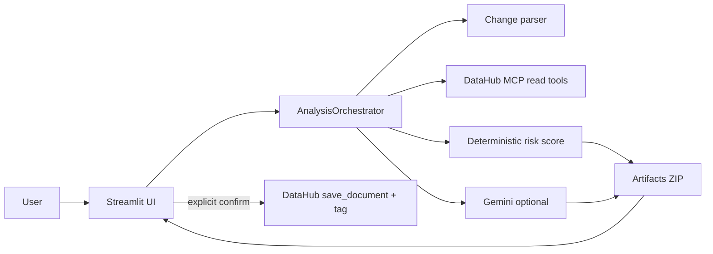

# ContextGuard

Schema-change safety agent for the [DataHub Agent Hackathon](https://datahub.devpost.com/).

Paste a proposed schema or dbt change. ContextGuard reads DataHub (lineage, schema, owners, usage, quality) via MCP, scores blast radius deterministically, and produces merge-ready compatibility SQL, dbt tests, a migration checklist, and owner notifications — with every impact claim cited to DataHub URNs.

## Challenge fit

- **Agents That Do Real Work** — end-to-end read → reason → act loop
- **Metadata-Aware Code Generation** — compatibility patches and dbt tests grounded in real catalog context

## Quick start (demo mode)

```bash
python -m venv .venv
source .venv/bin/activate
pip install -e ".[dev]"
streamlit run app.py
```

In the UI, enable **Demo mode** to walk the full flow without DataHub Cloud credentials.

## Live DataHub Cloud

1. Create a free DataHub Cloud trial and load sample metadata (`showcase-ecommerce` datapack when available, or use your tenant catalog).
2. Create a personal access token.
3. Copy `.env.example` → `.env`:

```bash
GOOGLE_API_KEY=...          # Gemini free tier (optional; deterministic fallback works without it)
DATAHUB_MCP_URL=https://<tenant>.acryl.io/integrations/ai/mcp
DATAHUB_TOKEN=...
CONTEXTGUARD_ALLOW_WRITEBACK=false
```

4. Run:

```bash
streamlit run app.py
```

Write-back (save review document + `contextguard-reviewed` tag) is **off by default** and requires an explicit UI confirmation.

## Examples

Checked-in sample inputs/outputs (no secrets):

- [`examples/breaking-drop-amount/`](examples/breaking-drop-amount/) — dropping `amount` with critical downstream dashboards
- [`examples/safe-status-type-noop/`](examples/safe-status-type-noop/) — low-risk type change with no dependents

Regenerate:

```bash
contextguard gen-examples
```

## Tests

```bash
python -m pytest -q
```

## Architecture

See [`docs/architecture.md`](docs/architecture.md) and [`docs/architecture.svg`](docs/architecture.svg).



## Submission notes

- License: Apache-2.0 (`LICENSE`)
- Demo script: [`docs/demo-script.md`](docs/demo-script.md)
- Devpost blurb: [`docs/devpost.md`](docs/devpost.md)

## Security

- Secrets stay in env / Streamlit secrets; exports strip raw MCP payloads
- Error messages redact Bearer tokens
- Public deploy should keep `CONTEXTGUARD_ALLOW_WRITEBACK=false`
