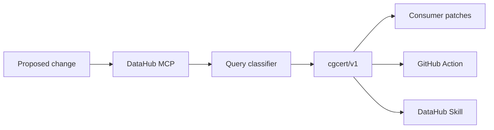

# ContextGuard

**Query-Aware Breakage Certificates** for schema changes — powered by DataHub.

> DataHub Impact Analysis lists dependents.  
> ContextGuard proves which **known queries break**, emits consumer patches, and **gates merge**.

Built for the [DataHub Agent Hackathon](https://datahub.devpost.com/).

## Why this wins vs stock DataHub

| Capability | DataHub Impact Analysis / MCP chat | ContextGuard |
|---|---|---|
| Downstream dependents | Yes | Yes |
| Classify each known query BREAKS/SAFE/UNKNOWN | No | **Yes (deterministic)** |
| Consumer patches per broken query | No | **Yes** |
| Merge gate (`merge_allowed`) | No | **Yes — GitHub Action** |
| Catalog write-back of certificate | Docs/tags manually | **Opt-in certificate document** |
| Agent Skill package | Lineage skill (explore) | **Breakage-cert skill** |

## Quick start (demo mode)

```bash
python -m venv .venv
source .venv/bin/activate
pip install -e ".[dev]"
streamlit run app.py
```

Enable **Demo mode**, select `ecommerce.public.orders`, enter `DROP COLUMN amount`.  
You should see **Merge allowed: NO**, BREAKS ≥ 1, and consumer patches.

## Live DataHub Cloud

```bash
cp .env.example .env
# GOOGLE_API_KEY=...          # optional
# DATAHUB_MCP_URL=https://<tenant>.acryl.io/integrations/ai/mcp
# DATAHUB_TOKEN=...
# CONTEXTGUARD_ALLOW_WRITEBACK=false
streamlit run app.py
```

## Merge gate (CI)

```bash
# Issue a certificate from a change request + evidence fixture
contextguard certify changes/demo/drop-amount.json --out-dir artifacts/drop --fail-on-breakage

contextguard check examples/breaking-drop-amount/breakage_certificate.json   # exits 1
contextguard check examples/safe-status-type-noop/breakage_certificate.json  # exits 0
```

GitHub Action posts a PR comment with the certificate table and blocks merge when `changes/active/*.json` has BREAKS.  
Override with PR label `allow-breakage`.

## DataHub Skill

See [`skills/contextguard-breakage-cert/`](skills/contextguard-breakage-cert/) (+ [`UPSTREAM.md`](skills/contextguard-breakage-cert/UPSTREAM.md) for contributing to `datahub-skills`).

## Examples

- [`examples/breaking-drop-amount/`](examples/breaking-drop-amount/) — certificate blocks merge
- [`examples/safe-status-type-noop/`](examples/safe-status-type-noop/) — certificate allows merge

```bash
contextguard gen-examples
python -m pytest -q
```

## Architecture

See [`docs/architecture.md`](docs/architecture.md), [`docs/architecture.svg`](docs/architecture.svg), and the winner-wedge spec:

[`docs/superpowers/specs/2026-07-25-breakage-certificates-design.md`](docs/superpowers/specs/2026-07-25-breakage-certificates-design.md)



## License

Apache-2.0
